# Profit Intel

### Customer Profitability & Discount Intelligence System

An executive-grade profitability intelligence platform designed to detect revenue concentration, discount dependency, margin leakage, customer retention risks, and commercial action opportunities.

Built as a full-stack analytical system using synthetic business data, PostgreSQL intelligence views, Flask backend logic, Jinja templating, and HTMX interactivity.

---

## Executive Summary

Most customer analytics dashboards answer:

* Who buys?
* How much they spend?

Profit Intel answers harder business questions:

* Which customers destroy profit through discounts?
* Which products silently leak margin?
* Which customer segments are truly sustainable?
* Which retained customers are weak-quality retention?
* Where should commercial teams intervene immediately?

This is not a BI dashboard.

This is a **Profitability Decision System**.

---

# Core Intelligence Modules

## 1. Executive Dashboard

Portfolio-wide profitability overview.

Tracks:

* Total Revenue
* Total Profit
* Overall Margin %
* Discount Risk Customers
* Retention Risk Customers
* Discount Dependent Customers
* Loss Making Customers

---

## 2. Customer Search Engine

Direct customer-level profitability lookup.

Analyze:

* Profit contribution
* Margin quality
* Discount usage
* Retention strength
* Customer type classification

---

## 3. Discount Dependency Analyzer

Identifies customers whose purchasing behavior depends heavily on discounts.

Flags:

* Pure Discount Buyers
* Moderate Discount Dependency
* Insufficient History

---

## 4. Margin Leakage Detector

Detects products generating revenue while weakening margins.

Tracks:

* Revenue
* Profit
* Margin %
* Discount %
* Product health

---

## 5. Retention Breakdown

Analyzes retained customers by profitability quality.

Detects:

* Organic loyal customers
* Weak loyalty masked by discounting
* Risk-prone retained customers

---

## 6. Segment Intelligence

Measures customer segment sustainability.

Evaluates:

* Revenue concentration
* Margin efficiency
* Profit per customer
* Discount sensitivity

---

## 7. Recommendation Engine

Converts intelligence into business actions.

Examples:

* Protect high-value customers
* Avoid deeper discounting
* Monitor retention risks
* Prevent margin erosion

---

## 8. Discount Simulator

Interactive pricing simulation engine.

Simulates:

* Discount changes
* Revenue shifts
* Margin compression
* Profit impact

---

# System Architecture

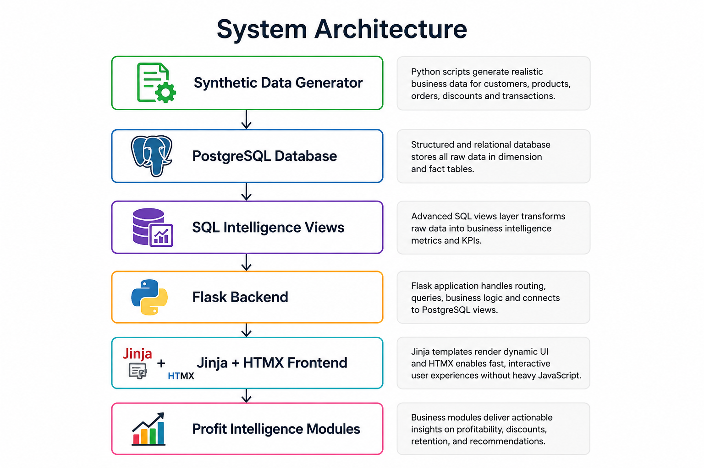


---

# Tech Stack

| Layer           | Technology |
| --------------- | ---------- |
| Backend         | Flask      |
| Database        | PostgreSQL |
| Frontend        | HTML + CSS |
| Templating      | Jinja2     |
| Interactivity   | HTMX       |
| Data Generation | Python     |
| Deployment      | Render     |

---

# Project Structure

```bash
profit-intel/
│── run.py
│── config.py
│── requirements.txt
│── Procfile
│── README.md
│── .env
│── .env.example
│── .gitignore
│
├── app/
│   │── __init__.py
│   │── db.py
│   │── routes.py
│   │
│   ├── templates/
│   │   ├── base.html
│   │   ├── dashboard.html
│   │   ├── customers.html
│   │   ├── customer_drilldown.html
│   │   ├── discount_dependency.html
│   │   ├── margin_leakage.html
│   │   ├── retention.html
│   │   ├── segments.html
│   │   ├── recommendations.html
│   │   ├── simulator.html
│   │
│   └── static/
│       ├── css/
│       │   └── style.css
│       └── js/
│
├── assets/
│   └── screenshots/
│       ├── 01_executive_dashboard.png
│       ├── 02_customer_search.png
│       ├── 03_customer_drilldown.png
│       ├── 04_discount_dependency.png
│       ├── 05_margin_leakage.png
│       ├── 06_retention_breakdown.png
│       ├── 07_segment_intelligence.png
│       ├── 08_discount_simulator_input.png
│       ├── 09_discount_simulator_output.png
│       ├── 10_recommendation_engine.png
│       └── 11_system_architecture.png
│
├── data/
│   └── generated/
│
├── database/
│   ├── schema/
│   ├── load/
│   └── analysis/
│
├── python/
│   ├── generate_data.py
│   └── validate_data.py
│
└── reports/
    └── executive_notes.md
```

---

# Database Setup

Create database:

```sql
CREATE DATABASE customer_profitability_discount_db;
```

Update `.env`:

```env
DB_HOST=localhost
DB_NAME=customer_profitability_discount_db
DB_USER=postgres
DB_PASSWORD=722004
DB_PORT=5432
```

Run schema:

```bash
psql -U postgres -d customer_profitability_discount_db -f database/schema/schema.sql
```

---

# Installation

Clone:

```bash
git clone https://github.com/yourusername/profit-intel.git
cd profit-intel
```

Install dependencies:

```bash
pip install -r requirements.txt
```

Run app:

```bash
python app.py
```

Open browser:

```bash
http://127.0.0.1:5000
```

---

# Screenshots

## 1. Executive Dashboard
Portfolio-wide profitability command center.

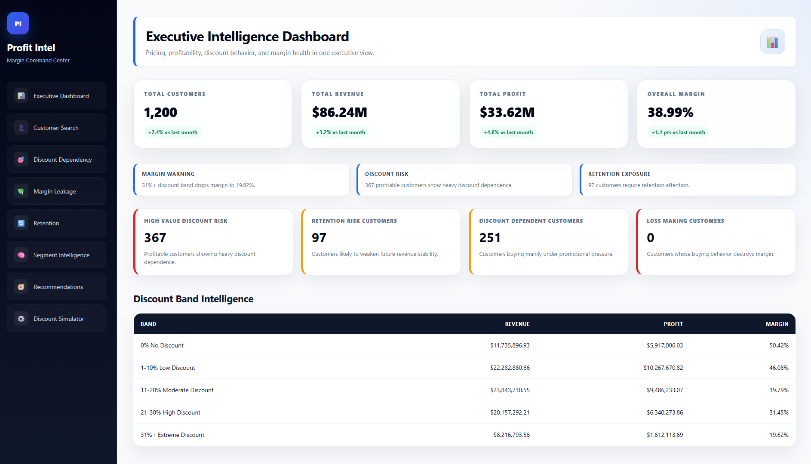

---

## 2. Customer Search Engine
Customer-level profitability intelligence and retention quality inspection.

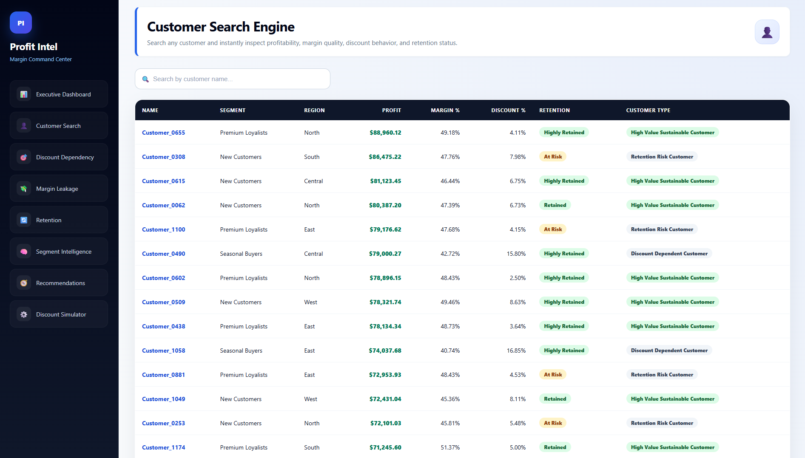

---

## 3. Customer Drilldown
Deep customer-level profitability behavior analysis.

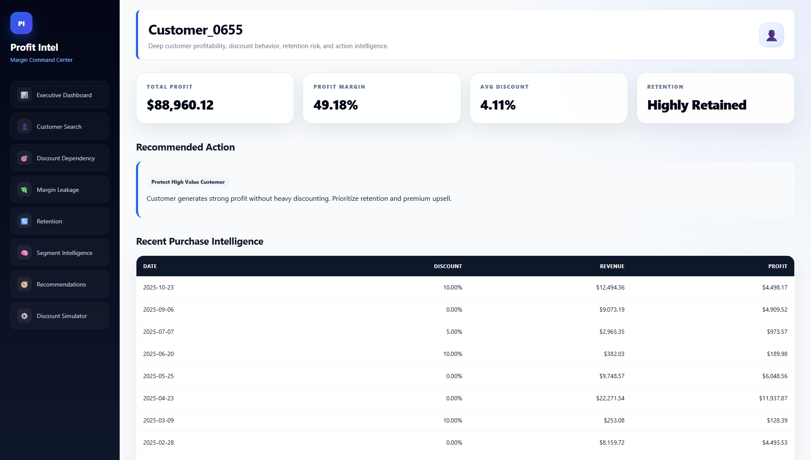

---

## 4. Discount Dependency Analyzer
Identifies customers driven by discount dependency.

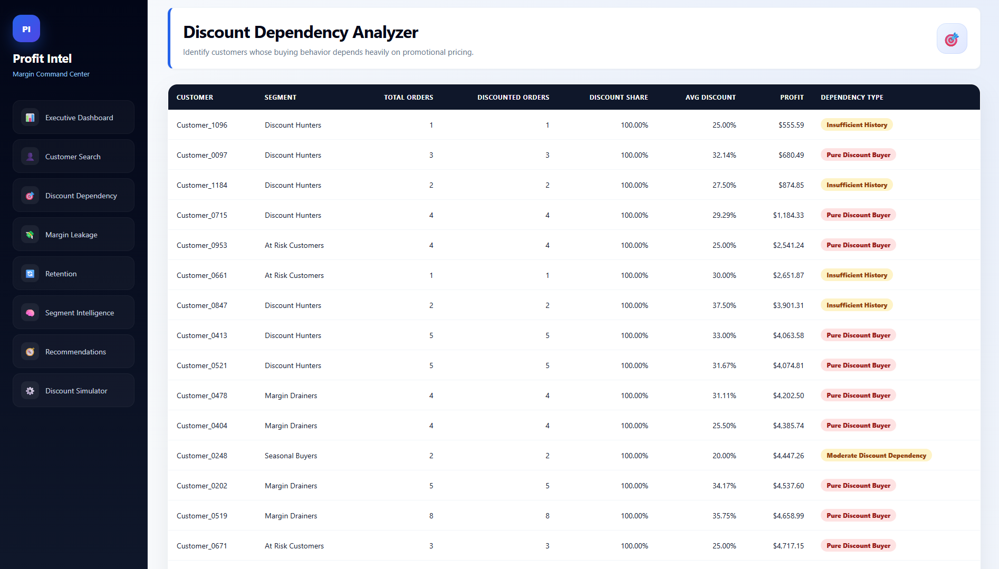

---

## 5. Margin Leakage Detector
Detects products silently eroding profit.

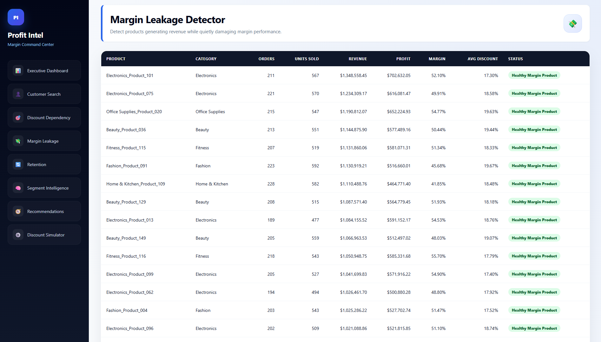

---

## 6. Retention Breakdown
Tracks loyalty quality and retention risk patterns.

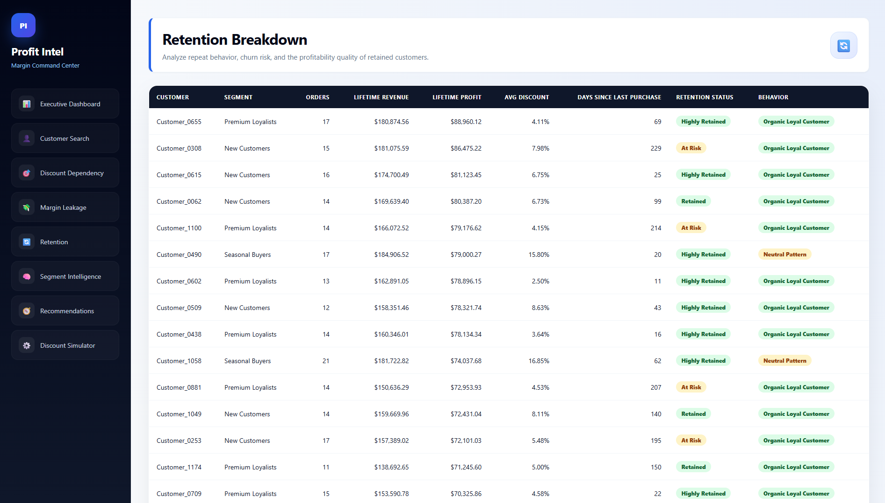

---

## 7. Segment Intelligence
Compares customer segment profitability sustainability.

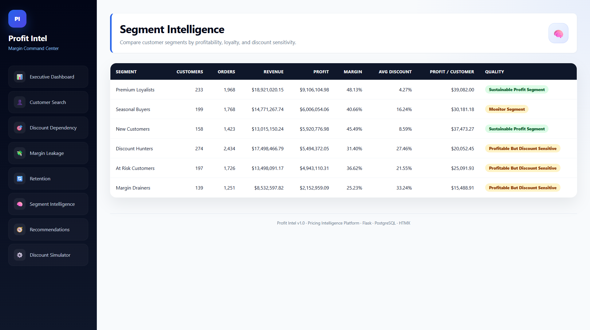

---

## 8. Discount Simulator (Input Layer)
Interactive pricing simulation engine.

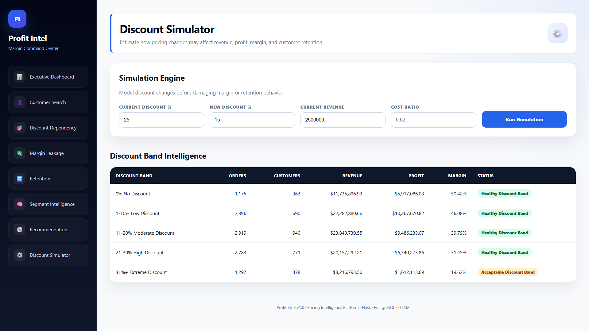

---

## 9. Discount Simulator (Output Layer)
Simulation results showing profit impact.

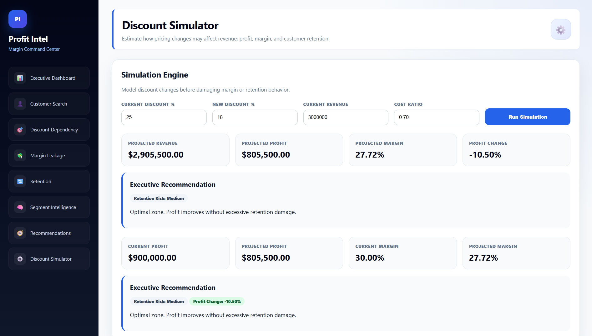

---

## 10. Recommendation Engine
Converts analytics into commercial actions.

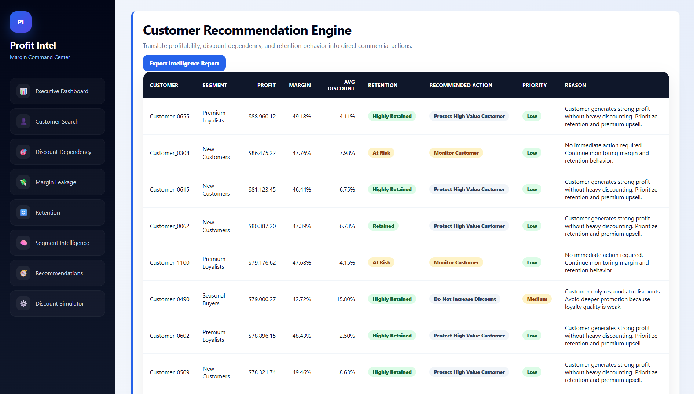


---

# Business Value

Profit Intel enables:

* Profit-first customer strategy
* Controlled discount optimization
* Margin leakage prevention
* Retention quality analysis
* Revenue sustainability planning
* Commercial action prioritization

---

# Why This Project Matters

Companies often focus on revenue.

Revenue without profitability is dangerous.

Profit Intel forces businesses to ask:

* Is this revenue sustainable?
* Is this customer profitable?
* Are discounts helping growth or hiding weakness?
* Is retention real or artificial?

This system converts operational sales data into strategic financial intelligence.

---

# Future Upgrades

Planned:

* PDF intelligence export
* Customer drilldown pages
* Scenario version saving
* Margin erosion forecasting
* Customer lifetime value scoring
* Executive alert system

---

# Author

Saami Anware
